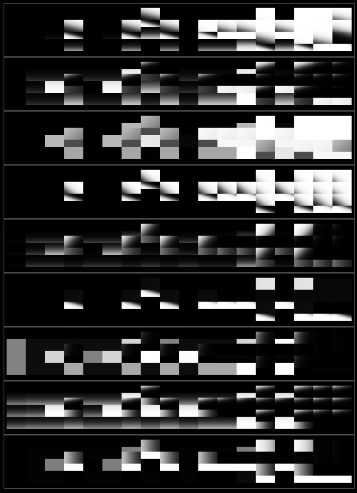
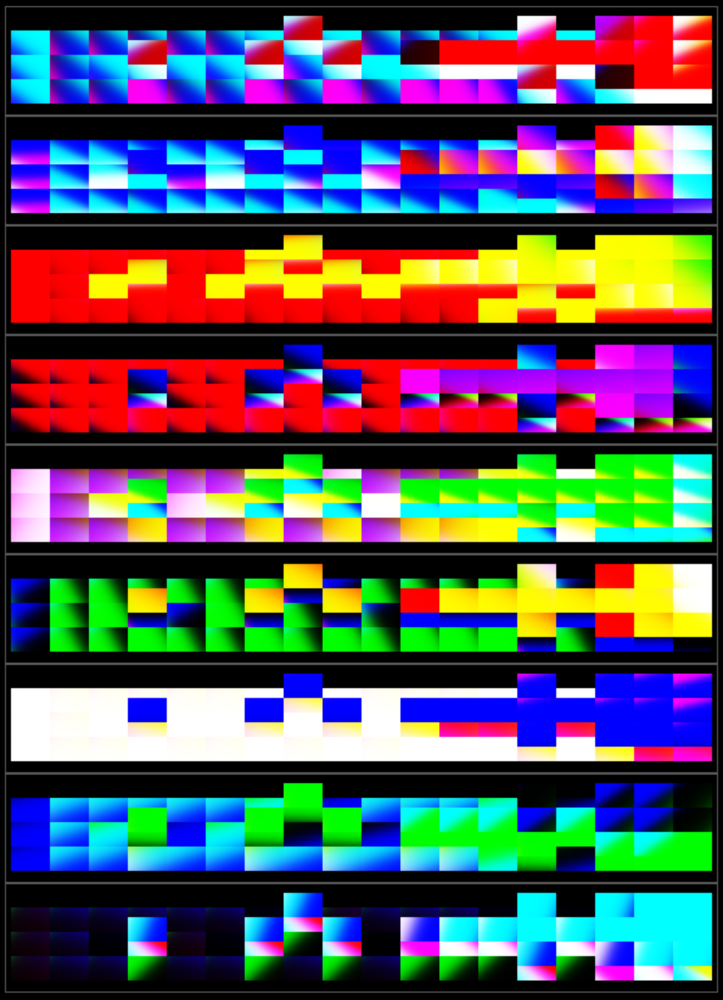

Generate small pixel art images using information about surrounding context with the NEAT genetic algorithm.

Here are some example images made by running `example_09_accidentally_art.py` and `example_10_accidentally_art_2.py`.

  
  

